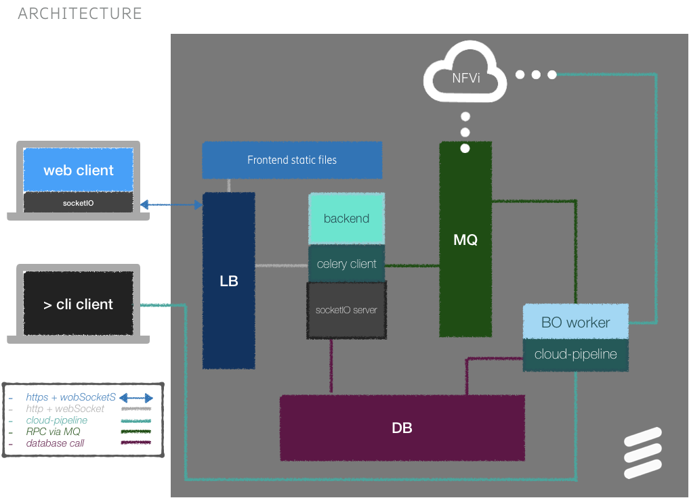
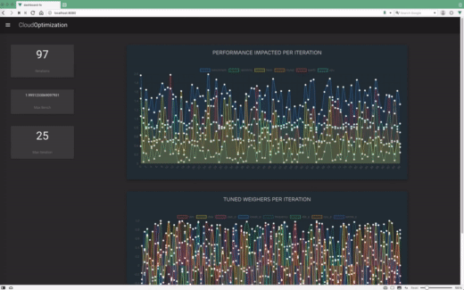
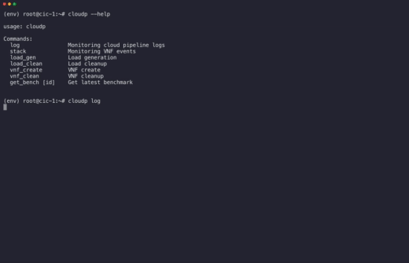
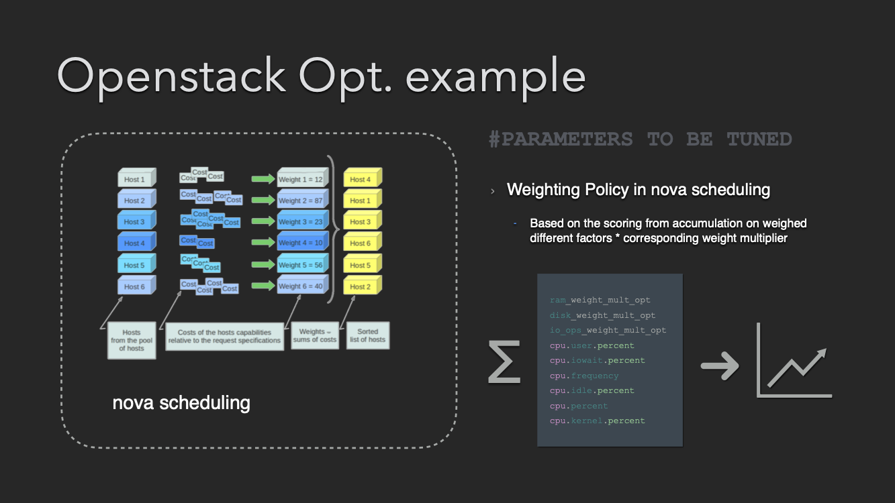
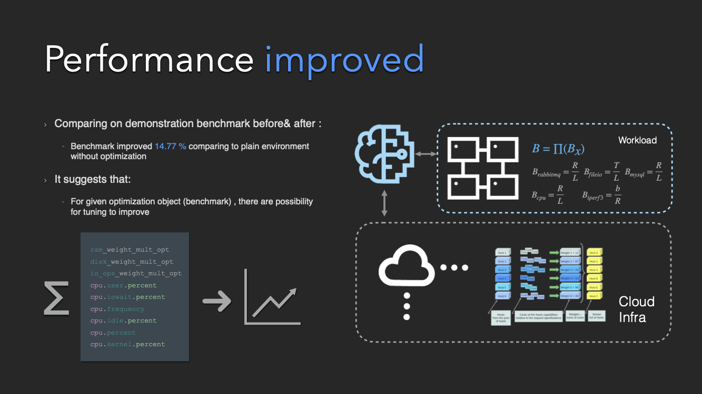

# ML based cloud resource optimization

This project is a PoC/example to show automation of large-scale Cloud Infra optimization with the orchestration tech and BO to decouple cross-domain expertise and accelerate the experiments to a new level.

Below is the arch digram:

Cloud-pipeline([README](https://github.com/wey-gu/AutoOptCloud/tree/master/cloud_pipeline)) automated expensive experiments by wiring the circle:

- With given parameter as input, [Perform Parameter Applying](https://github.com/wey-gu/AutoOptCloud/blob/master/cloud_pipeline/cloud_pipeline/handler/conf_handler.py) towards the Cloud Infra System
- Running [Backgroud Traffic load](https://github.com/wey-gu/AutoOptCloud/blob/master/study/benchmark/benchmark_env.md#pre-defined-vms-for-load-generation) on the system with predefined Applications: [code](https://github.com/wey-gu/AutoOptCloud/blob/master/cloud_pipeline/cloud_pipeline/handler/load_generator.py)
- [Instantiating ](https://github.com/wey-gu/AutoOptCloud/blob/master/cloud_pipeline/cloud_pipeline/handler/vnf_handler.py) a given [Application](https://github.com/wey-gu/AutoOptCloud/blob/master/cloud_pipeline/cloud_pipeline/resources/templates/vnf.yaml) under scheduling policy defined by the parameter and Run a [Benchmark defined here](https://github.com/wey-gu/AutoOptCloud/blob/master/study/benchmark/benchmark_env.md#benchmark-definitions)
- [Collect Benchmark data](https://github.com/wey-gu/AutoOptCloud/blob/master/cloud_pipeline/cloud_pipeline/handler/data_collector.py) and cleanup env to be ready for next epoch

With the circle connected by Cloud-pipeline, we could run optimization with Bayesian Optimization in a jupyter notebook: [demo](https://github.com/wey-gu/AutoOptCloud/blob/master/bayesian_optimization/BO_integration.ipynb)

Those things put as predefined ones while should be inputs of the toolchain itself:

- The given parameter to tune
- The background traffic
- The optimization target for application workload & its Benchmark([here](https://github.com/wey-gu/AutoOptCloud/tree/master/study/benchmark))

Also, a dashboard(code: [frontend](https://github.com/wey-gu/AutoOptCloud/tree/master/visualization/dashboard-fe), [backend](https://github.com/wey-gu/AutoOptCloud/tree/master/dashboard)) to help visualization of the training process and the outcome of the tuning was created below is a screen record for it: https://vimeo.com/497995660

And, not just [calling them in python](https://github.com/wey-gu/AutoOptCloud/tree/master/cloud_pipeline#manually-test), a CLI for cloud-pipeline was also created to easily debug, operate the experiment in a handy way, here is a screen record for that: https://vimeo.com/497997340

#### Parameter to tune

#### Benchmark, PoC result

