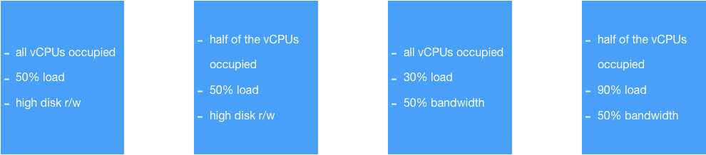

[TOC]


## Benchmark definitions


>  This document described benchmark definitions. The `LeTex` could be ugly as it's trying to fit format on both gitlab and github 😭...


### rabbitmq benchmark

> command

```bash
ulimit -n 65536; \
perf-test_linux_x86_64 --queue-pattern 'perf-test-%d' \
    --queue-pattern-from 1 --queue-pattern-to 1000 \
    --producers 1000 --consumers 1000 \
    --heartbeat-sender-threads 10 \
    --publishing-interval 5 -z 30
```

> output example

```bash
id: test-085859-070, time: 2.884s, sent: 0.35 msg/s, received: 0 msg/s, min/median/75th/95th/99th consumer latency: 0/0/0/0/0 µs
id: test-085859-070, time: 7.884s, sent: 20 msg/s, received: 20 msg/s, min/median/75th/95th/99th consumer latency: 5270/37998/45923/49561/51762 µs
id: test-085859-070, time: 12.884s, sent: 20 msg/s, received: 20 msg/s, min/median/75th/95th/99th consumer latency: 3741/26498/30683/32470/33019 µs
id: test-085859-070, time: 17.884s, sent: 20 msg/s, received: 20 msg/s, min/median/75th/95th/99th consumer latency: 3234/28895/33228/36826/39696 µs
id: test-085859-070, time: 22.884s, sent: 20 msg/s, received: 20 msg/s, min/median/75th/95th/99th consumer latency: 1258/25191/29820/32788/32994 µs
id: test-085859-070, time: 27.884s, sent: 20 msg/s, received: 20 msg/s, min/median/75th/95th/99th consumer latency: 1236/22097/25530/31665/32503 µs
id: test-085859-070, time: 32.884s, sent: 20 msg/s, received: 20 msg/s, min/median/75th/95th/99th consumer latency: 1068/27567/29919/35258/36879 µs
id: test-085859-070, sending rate avg: 17 msg/s
id: test-085859-070, receiving rate avg: 17 msg/s
```

> definition

Here we use `receiving rate avg` **devision** by  the mean of `95th consumer latency` in `ms ` : $`\frac {\sum_{95th}l } {n \times 1000}`​$ for this benchmark definition: 

$$B_{rabbitmq} = \frac {R}{L}  $$ .

```math
B_{rabbitmq} = \frac {R}{L} 
```


>note: 

$`B`$ : `Benchmark`

$`R`​$ : `receiving rate avg`

$`l`$:  `consumer latency`

$`L`$:   `95th consumer latency` in `ms` :

 $` \frac {\sum_{95th}l } {n \times 1000} `$

```math
 \frac {\sum_{95th}l } {n \times 1000}
```


### fileio benchmark

```bash
sysbench fileio --file-total-size=32G prepare
sysbench fileio --file-total-size=32G \
  --file-test-mode=rndrw \
  --time=300 \
  --max-requests=0 \
  --threads=10 \
  run
```

> result example

```bash

Extra file open flags: (none)
128 files, 120MiB each
15GiB total file size
Block size 16KiB
Number of IO requests: 0
Read/Write ratio for combined random IO test: 1.50
Periodic FSYNC enabled, calling fsync() each 100 requests.
Calling fsync() at the end of test, Enabled.
Using synchronous I/O mode
Doing random r/w test
Initializing worker threads...

Threads started!

File operations:
    reads/s:                      1070.51
    writes/s:                     713.67
    fsyncs/s:                     2284.01

Throughput:
    read, MiB/s:                  16.73                 # we care about this
    written, MiB/s:               11.15                 # we care about this

General statistics:
    total time:                          300.0195s
    total number of events:              1220435

Latency (ms):
         min:                                    0.00
         avg:                                    0.25
         max:                                   24.26
         95th percentile:                        0.90   # we care about this
         sum:                               299135.05

Threads fairness:
    events (avg/stddev):           1220435.0000/0.00
    execution time (avg/stddev):   299.1351/0.00
```

> definition

Here we use `product of r/w Throughput.` in $` (MiB/s)^2`​$  **devision** by  the mean of `95th percentile latency` in `ms ` $` L` ​$ for this benchmark definition: 

$$B_{fileio} = \frac {R}{L}  ​$$ .

```math
B_{fileio} = \frac {R}{L} 
```


> note: 

$`B`​$ : `Benchmark`

$`R`​$ : `product of r/w Throughput.` :  $`{r \times w} `​$

```math
{r \times w}
```


$`L`​$:  `95th percentile latency`

### mysql benchmark

> create default db name and grant permissions

```mysql
CREATE DATABASE sbtest;
CREATE USER sbtest@localhost;
GRANT ALL PRIVILEGES ON sbtest.* TO sbtest@localhost;
```


```bash
mysql -e "CREATE DATABASE sbtest;"
mysql -e "CREATE USER sbtest@localhost;"
mysql -e "GRANT ALL PRIVILEGES ON sbtest.* TO sbtest@localhost;"

sysbench oltp_read_write \
  --mysql-user=root \
  --mysql-socket='/var/run/mysqld/mysqld.sock' \
  --tables=20 \
  --table_size=100000 \
  --threads=10 \
  --time=120 \
  prepare

sysbench oltp_read_write \
  --mysql-user=root \
  --mysql-socket='/var/run/mysqld/mysqld.sock' \
  --tables=20 \
  --table_size=100000 \
  --threads=10 \
  --time=120 \
  run
```

> result example

```bash
sysbench 1.0.17 (using bundled LuaJIT 2.1.0-beta2)

Running the test with following options:
Number of threads: 10
Initializing random number generator from current time


Initializing worker threads...

Threads started!

SQL statistics:
    queries performed:
        read:                            777364
        write:                           222104
        other:                           111052
        total:                           1110520
    transactions:                        55526  (462.61 per sec.)   
    queries:                             1110520 (9252.17 per sec.) # we care about this
    ignored errors:                      0      (0.00 per sec.)
    reconnects:                          0      (0.00 per sec.)

General statistics:
    total time:                          120.0261s
    total number of events:              55526

Latency (ms):
         min:                                    5.67
         avg:                                   21.61
         max:                                  230.81
         95th percentile:                       42.61              # we care about this
         sum:                              1199979.55

Threads fairness:
    events (avg/stddev):           5552.6000/54.91
    execution time (avg/stddev):   119.9980/0.01
```

> definition

Here we use `queries per sec.` **devision** by  the mean of `95th percentile latency` in `ms ` $`L`$ for this benchmark definition: 

$$B_{mysql} = \frac {R}{L}  ​$$ .

```math
B_{mysql} = \frac {R}{L} 
```


> note: 

$`B`​$ : `Benchmark`

$`R`​$ : `transactions per sec.`

$`L`​$:  `95th percentile latency`

### cpu benchmark

```bash
sysbench cpu --cpu-max-prime=20000 run
```

> result example

```bash
sysbench 1.0.17 (using bundled LuaJIT 2.1.0-beta2)

Running the test with following options:
Number of threads: 1
Initializing random number generator from current time

Prime numbers limit: 20000
Initializing worker threads...
Threads started!

CPU speed:
    events per second:   314.76                      #<------------- the one we cares in this run
General statistics:
    total time:                          10.0024s    
    total number of events:              3149
Latency (ms):
         min:                                    3.14
         avg:                                    3.18
         max:                                    6.30
         95th percentile:                        3.19 #<------------- the one we cares in this run
         sum:                                 9999.92

Threads fairness:
    events (avg/stddev):           3149.0000/0.00
    execution time (avg/stddev):   9.9999/0.00
```

> definition

Here we use `events per second.` **devision** by  the mean of `95th percentile latency` in `ms ` $`L`$ for this benchmark definition: 

$$B_{cpu} = \frac {R}{L}  $$ .

```math
B_{cpu} = \frac {R}{L}  
```


> note: 

$`B`​$ : `Benchmark`

$`R`​$ : `transactions per sec.`

$`L`​$:  `95th percentile latency`

### `iperf3` benchmark

> command

```bash
iperf3 -c ${iperf_server_host} -t 60 -P 16
```


> output 

What we care here:

- `Retr` (TCP segments retransmitted) 
- `Bandwidth` 

```bash
...
[ ID] Interval           Transfer     Bandwidth       Retr  Cwnd
...
[SUM]   0.00-60.00  sec  9.63 GBytes  1.38 Gbits/sec  277929             sender
[SUM]   0.00-60.00  sec  9.62 GBytes  1.38 Gbits/sec                  receiver
```


> definition

Here we use `Bandwidth` in `Mbits/sec.`  **devision** by  the mean of `Retr`  for this benchmark definition: 

$$B_{iperf3} = \frac {b}{R}  ​$$ .

```math
B_{iperf3} = \frac {b}{R}  
```


> note: 

$`B`$ : `Benchmark`

$`b`​$ : `Bandwidth`

$`R`$:  `Retr`

### 

## Pre-defined VMs for load generation





## Prepare image for benchmark

### download and resize

> we use the 18.04 ubuntu LTS cloud image

```bash
wget https://cloud-images.ubuntu.com/bionic/current/bionic-server-cloudimg-amd64.img
```

> increase it 

For the reason I am working on Ubuntu 16.04, I need to complie newer `e2fsck`

```bash
# git clone git://git.kernel.org/pub/scm/fs/ext2/e2fsprogs.git
# cd e2fsprogs
# mkdir build; cd build
# ../configure
# make
# make install
# e2fsck -V
e2fsck 1.45.0 (6-Mar-2019)
        Using EXT2FS Library version 1.45.0, 6-Mar-2019
```

> resize it

```bash
qemu-img resize bionic-server-cloudimg-amd64.img +2G
qemu-img create -f qcow2 -o preallocation=metadata newdisk.qcow2 4208.3M
virt-resize --resize /dev/sda1=4G bionic-server-cloudimg-amd64.img newdisk.qcow2
mv newdisk.qcow2 bionic-server-cloudimg-amd64-4G.img
```

### modifying the image

#### preparation

> mount the image, configure dns, verify it with a ping

```bash
apt-get install qemu-utils
modprobe nbd
qemu-nbd --connect=/dev/nbd0 bionic-server-cloudimg-amd64.img

fdisk -l

Disk /dev/nbd0: 7.1 GiB, 7633948160 bytes, 14910055 sectors
Units: sectors of 1 * 512 = 512 bytes
Sector size (logical/physical): 512 bytes / 512 bytes
I/O size (minimum/optimal): 512 bytes / 512 bytes
Disklabel type: gpt
Disk identifier: FCF57EE0-2117-461B-8E72-8723796B84D9

Device       Start      End  Sectors  Size Type
/dev/nbd0p1   2048    10239     8192    4M BIOS boot
/dev/nbd0p2  10240   227327   217088  106M EFI System
/dev/nbd0p3 227328 14907391 14680064    7G Linux filesystem


mkdir /mnt/ubuntu
mount /dev/nbd0p1 /mnt/ubuntu 
mount -t proc proc /mnt/ubuntu/proc/
mkdir -p /mnt/ubuntu/run/systemd/resolve/
cp /etc/resolv.conf /mnt/ubuntu/run/systemd/resolve/stub-resolv.conf

sudo chroot /mnt/ubuntu ping ubuntu.com
sudo chroot /mnt/ubuntu df -h
Filesystem      Size  Used Avail Use% Mounted on
/dev/nbd0p3     2.0G  2.0G   13M 100% /

sudo resize2fs /dev/nbd0p3

chroot /mnt/ubuntu df -h
Filesystem      Size  Used Avail Use% Mounted on
/dev/nbd0p3     6.8G  2.0G  4.8G  29% /
```

> chroot to the shell of the image

```bash
chroot /mnt/ubuntu bash
```

#### Install packages

> install needed packages

- `rabbitmq`
- `rabbitmq-perf-test` (https://github.com/rabbitmq/rabbitmq-perf-test/releases)
- `iperf3`
- `hdparm` # comes out-of-box with ubuntu
- `sysbench`
- `stress-ng`
- `mysql`

```bash
# rabbitmq
wget -O - "https://packagecloud.io/rabbitmq/rabbitmq-server/gpgkey" | apt-key add -
curl -s https://packagecloud.io/install/repositories/rabbitmq/rabbitmq-server/script.deb.sh | bash
wget https://packages.erlang-solutions.com/erlang-solutions_1.0_all.deb
dpkg -i erlang-solutions_1.0_all.deb
rm erlang-solutions_1.0_all.deb
apt-get install erlang erlang-nox
apt-get install rabbitmq-server -y

# rabbitmq-perf-test
cd /usr/bin
wget https://github.com/rabbitmq/rabbitmq-perf-test/releases/download/v2.7.0/perf-test_linux_x86_64
chmod +x /usr/bin/perf-test_linux_x86_64

# iperf3
apt-get install iperf3

# sysbench
curl -s https://packagecloud.io/install/repositories/akopytov/sysbench/script.deb.sh | sudo bash
apt -y install sysbench

# stress-ng
apt-get install stress-ng
# mysql

```

#### configuration

> change open file limit
>
> If this is not working, consider add `ulimit -n 65536` before calling test

```bash
echo "* soft nofile 65536" >> /etc/security/limits.conf
echo "* hard nofile 65536" >> /etc/security/limits.conf

vim /etc/systemd/user.conf
"DefaultLimitNOFILE=65535"
vim /etc/systemd/system.conf
"DefaultLimitNOFILE=65535"
```

> Release the mounted image

```bash
rm /mnt/ubuntu/run/systemd/resolve/stub-resolv.conf
umount /mnt/ubuntu/proc
umount /mnt/ubuntu
qemu-nbd --disconnect /dev/nbd0
```

### upload image to glance

```bash
glance image-create --name bionic-server-cloudimg-amd64-cloud-pipeline --disk-format qcow2 --container-format bare --file bionic-server-cloudimg-amd64-ML-CL.img

+------------------+--------------------------------------+
| Property         | Value                                |
+------------------+--------------------------------------+
| checksum         | 15246575a41049573ec04054cff2c062     |
| container_format | bare                                 |
| created_at       | 2019-04-13T07:55:24Z                 |
| disk_format      | qcow2                                |
| id               | 57d25622-35b9-40c3-bbc0-c51cbb2efe7c |
| min_disk         | 0                                    |
| min_ram          | 0                                    |
| name             | ml-cl-image                          |
| owner            | cb4a14edfe264772849b1d0b4fa54295     |
| protected        | False                                |
| size             | 1391591424                           |
| status           | active                               |
| tags             | []                                   |
| updated_at       | 2019-04-13T07:55:51Z                 |
| virtual_size     | None                                 |
| visibility       | private                              |
+------------------+--------------------------------------+
```

